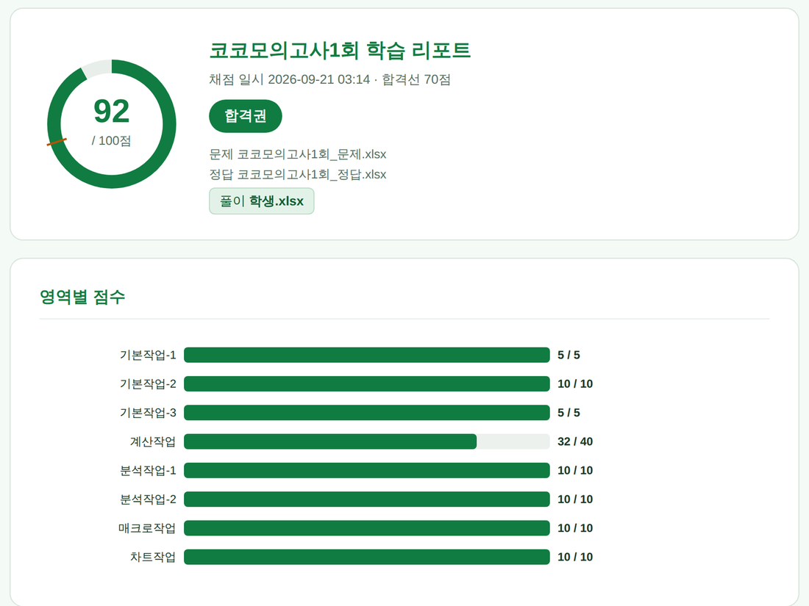
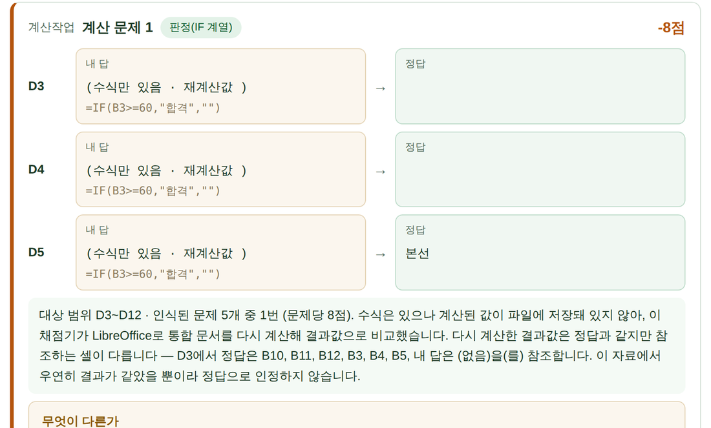
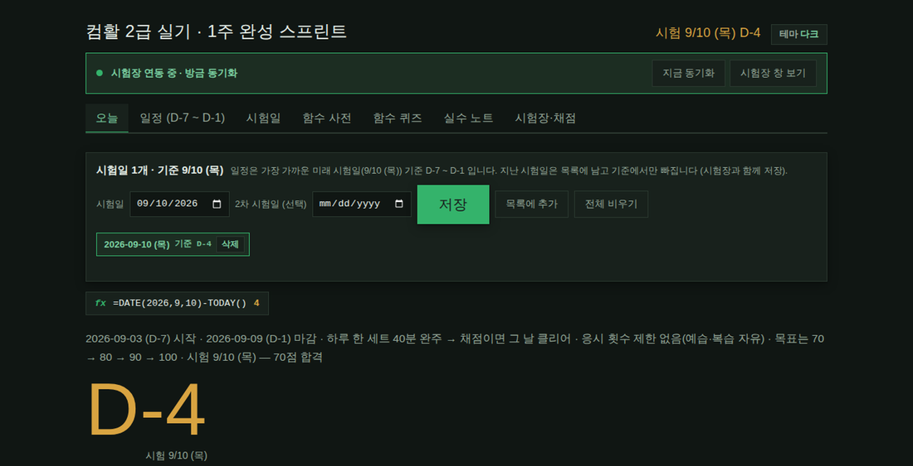

# 코코 스터디 툴즈

**컴활 2급 실기 대비 학습 도구** — Excel로 푼 풀이를 정답 파일과 자동으로
비교해 채점하고, 오답노트와 취약점 리포트를 만들어 줍니다. 무료이고
소스가 전부 열려 있습니다(MIT).

> 수험생 한 사람이 독학하면서 만든 **비공식 개인 제작 도구**입니다.
> 시험 시행처와는 아무 관계가 없고, 어떤 기관의 인증이나 승인도 받지
> 않았습니다. 자세한 내용은 아래 [이름에 대하여](#이름에-대하여) 참고.

---

## 화면

**제출하면 바로 나오는 학습 리포트** — 영역별로 어디서 깎였는지 보여 줍니다.



**오답노트** — 내 답과 정답을 나란히 놓고, 무엇이 왜 다른지 설명합니다.



**루틴 페이지** — 시험일만 넣으면 남은 기간에 맞춰 일정이 짜입니다.
프로그램에서 [루틴 열기]로 들어갑니다.



---

## 목차

1. [이 도구가 하는 일](#이-도구가-하는-일)
2. [★ 내 문제지를 넣어 쓰는 법 (핵심)](#-내-문제지를-넣어-쓰는-법-핵심)
3. [설치 — 파이썬을 한 번도 안 깔아 봤다면](#설치--파이썬을-한-번도-안-깔아-봤다면)
4. [설치가 안 될 때](#설치가-안-될-때)
5. [쓰는 법](#쓰는-법)
6. [⚠ 자동 업데이트 고지](#-자동-업데이트-고지)
7. [면책 — 채점 결과는 참고용입니다](#면책--채점-결과는-참고용입니다)
8. [학습 콘텐츠와 저작권](#학습-콘텐츠와-저작권)
9. [이름에 대하여](#이름에-대하여)
10. [라이선스 · 기여 · 이슈](#라이선스--기여--이슈)

---

## 이 도구가 하는 일

컴활 2급 실기는 "Excel 파일을 지시대로 고치는" 시험이라, 내가 푼 파일과
정답 파일을 셀 단위로 비교하면 채점을 자동화할 수 있습니다. 이 도구는
그걸 합니다. **문제 파일**(빈 상태)과 **정답 파일**의 차이를 뽑아 "이번
문제에서 손대야 할 곳"을 찾아내고, 거기에 내가 뭘 어떻게 했는지 비교해
100점 만점으로 점수를 내고 **왜 틀렸는지를 한 항목씩 설명하는 HTML
리포트**를 만들어 줍니다 — 값·수식뿐 아니라 글꼴·테두리·표시 형식·조건부
서식·정의된 이름·차트·매크로(VBA)까지 봅니다. 여기에 40분 타이머를 걸고
실전처럼 응시하게 해 주는 **시험장 런처**가 붙어 있어서, 응시 기록이
쌓이면 점수 추이·취약 영역·다시 풀 세트를 정리해 보여 주고 시험일까지
남은 기간에 맞춰 오늘 뭘 할지 추천해 줍니다.

구성 파일은 이렇습니다.

| 파일 | 하는 일 |
|---|---|
| `시험장.py` · `코코시험장.pyw` | 시험장 런처 (세트 선택 → 40분 타이머 → 제출 → 자동 채점 → 기록·리포트·일정) |
| `grade.py` · `코코채점.pyw` | 채점기. 런처 없이 파일 3개만 골라 채점할 수도 있습니다 |
| `기대값/*.json` | 세트별 채점 보정값(배점·문제 묶음·제외 규칙). **셀 주소와 점수만** 들어 있고 문제·정답 내용은 없습니다 |
| `모의고사/` · `드릴/` | 기본으로 딸려 오는 **자체 제작 연습 세트** (아래 참고) |
| `루틴.html` | 학습 루틴 웹 페이지. 프로그램 안의 로컬 서버가 띄워 줍니다 |
| `정정/점수정정.json` | 지난 채점 결과를 나중에 바로잡기 위한 정정 데이터 |
| `version.json` | 자동 업데이트 메타데이터 |

기본으로 딸려 오는 연습 세트(전부 자체 제작이고 가상 데이터입니다):

- **코코 모의고사 1회·2회** — 실기 전 영역(기본작업·계산작업·분석작업·
  매크로/차트)을 한 세트로 묶은 40분짜리 모의고사. 문제지 PDF 포함.
- **계산드릴** — 계산작업만 6유형 24문항(판정 / 시간·날짜 / 참조 /
  데이터베이스 / 통계·조건 / 문자열). 시트 하나가 한 유형입니다.

**이 세트들은 어디까지나 예제입니다.** 이 도구의 본래 용도는 아래처럼
**내가 공부하던 문제·정답 파일을 넣어 쓰는 것**입니다.

---

## ★ 내 문제지를 넣어 쓰는 법 (핵심)

설치 폴더 안 어디든 **`_문제` 파일과 `_정답` 파일을 같은 이름으로 짝지어**
넣어 두면, 시험장이 알아서 한 세트로 묶어 목록에 띄우고 채점·일정에
씁니다. 따로 등록하는 절차는 없습니다.

### 폴더 배치

```
코코시험장\                         ← 설치 폴더 (= 세트를 찾아다니는 범위)
│
├─ 시험장\
│   ├─ 시험장.py
│   ├─ 코코시험장.pyw               ← 평소 여기를 더블클릭
│   ├─ 루틴.html                    (자동 업데이트가 여기에 둡니다)
│   └─ 세트설정.json                (처음 실행하면 자동 생성)
│
├─ 채점\
│   ├─ grade.py
│   └─ 코코채점.pyw                 ← 채점만 하고 싶을 때
│
├─ 기대값\                          ← 자동으로 채워집니다 (손대지 않아도 됩니다)
├─ 정정\
│
├─ 모의고사\                        ← 기본 예제 (자동 배포)
│   ├─ 코코모의고사1회_문제.xlsx
│   ├─ 코코모의고사1회_정답.xlsx
│   ├─ 코코모의고사1회_문제지.pdf
│   └─ 코코모의고사2회_…
│
├─ 드릴\                            ← 기본 예제 (자동 배포)
│   ├─ 계산드릴_문제.xlsx
│   ├─ 계산드릴_정답.xlsx
│   └─ 계산드릴_문제지.pdf
│
└─ 내문제\                     ★★★ 여기에 내 자료를 넣습니다 (폴더 이름은 자유)
    ├─ 2024 상시1회_문제.xlsx
    ├─ 2024 상시1회_정답.xlsx
    ├─ 2024 상시1회_문제지.pdf      (선택)
    │
    └─ 학원교재\                    ← 폴더를 더 나눠도 됩니다
        ├─ 3강 실습_문제.xlsx
        └─ 3강 실습_정답.xlsx
```

찾아다니는 범위는 **`시험장.py`가 들어 있는 폴더의 바로 위 폴더 전체**
(위 그림에서 `코코시험장\`)이고, 그 아래 하위 폴더는 몇 겹이든 다
훑습니다. 다른 곳에 있는 폴더를 쓰고 싶으면
`python 시험장.py --scan-root "D:\내자료"` 로 바꿀 수 있습니다.

### 파일 이름 규칙

한 세트는 **문제 파일 1개 + 정답 파일 1개**입니다. 이름의 앞부분(세트
이름)이 같고 뒤에 역할이 붙으면 됩니다.

```
<세트 이름>_문제.xlsx      ← 필수. 빈 상태(= 시험 시작 상태) 파일
<세트 이름>_정답.xlsx      ← 필수. 다 푼 상태 파일
<세트 이름>_문제지.pdf     ← 선택. 있으면 시험 시작할 때 같이 열어 줍니다
<세트 이름>_기대값.json    ← 선택. 배점·제외 규칙 보정용 (없어도 채점됩니다)
```

- **확장자**는 `.xlsx` · `.xlsm` 둘 다 됩니다. 문제는 `.xlsx`, 정답은
  `.xlsm` 처럼 서로 달라도 한 세트로 묶입니다(매크로 문제가 있으면 정답이
  `.xlsm`인 게 보통입니다).
- **띄어쓰기·밑줄·괄호는 자유**입니다. 이름을 비교할 때 공백 `_` `-`
  `()` `[]` `.` `,` 같은 구분자는 무시하므로 아래는 전부 한 세트로
  묶입니다.
  ```
  2024 A형 문제.xlsx      +  2024 A형 정답.xlsm
  2024_A형_문제.xlsx      +  2024_A형_정답.xlsx
  2024 A형(문제).xlsx     +  2024 A형(정답).xlsx
  ```
- 역할은 **파일 이름에 든 낱말**로 정합니다: `정답` 또는 `답안`이 들어
  있으면 정답 파일, `문제`가 들어 있으면 문제 파일입니다. (한 폴더에
  파일이 둘뿐이고 한쪽에만 `정답`이 있으면 나머지를 문제로 봅니다.)
- **넣으면 안 되는 이름**: `풀이_`로 시작하는 파일은 "내가 푼 답안"으로
  보고 세트 후보에서 뺍니다. `채점결과` 폴더, 그리고 `.`이나 `__`로
  시작하는 폴더도 통째로 건너뜁니다. Excel이 만드는 임시 파일(`~$…`)도
  무시합니다.

### 잘 인식됐는지 확인하기

시험장 시작 화면에 세트 목록이 그대로 보입니다. 안 보이면:

1. **[세트 인식 진단]** 버튼 — 어떤 파일을 찾았고, 어떤 이름으로 묶었고,
   왜 짝을 못 맞췄는지 표로 보여 줍니다. 대부분 여기서 원인이 바로
   드러납니다(가장 흔한 원인: 정답 파일 이름에 `정답`이 안 들어 있음).
2. **[직접 선택...]** 버튼 — 이름 규칙과 상관없이 문제/정답 파일을 직접
   골라 바로 응시할 수 있습니다.

### 내 세트로 무엇이 되나

- **채점** — 문제 파일과 정답 파일의 차이가 곧 채점 기준이라, 기대값
  JSON이 없어도 채점됩니다. 기대값 JSON은 배점을 문제지와 맞추거나
  정답 파일의 잔여 서식을 빼는 **보정용**이라 없으면 없는 대로 동작합니다.
- **일정** — 시험 날짜를 넣어 두면 남은 기간에 맞춰 "오늘 뭘 할지"를
  하루 한 세트 기준으로 추천하고, 인식된 세트 중에서 아직 안 풀었거나
  점수가 낮은 것을 골라 줍니다. (이 일정 부분은 지금 손보는 중이라 화면
  구성과 세부 규칙은 버전에 따라 달라질 수 있습니다.)

---

## 설치 — 파이썬을 한 번도 안 깔아 봤다면

Windows + Excel(엑셀) + Python 이 필요합니다. Excel은 실제 설치된
Microsoft Excel이어야 합니다(웹용 Excel·구글 시트로는 응시가 안 됩니다).
아래 순서대로 하면 10분쯤 걸립니다.

### 1단계 — Python 설치

1. https://www.python.org/downloads/ 에서 **Download Python** 버튼을
   눌러 설치 파일을 받습니다.
2. 받은 파일을 실행하면 첫 화면 **맨 아래**에 체크박스가 있습니다.
   **`Add python.exe to PATH` 를 반드시 체크**하세요. 이걸 빼먹으면
   나중에 `pip` 명령이 안 먹혀서 대부분 여기서 막힙니다.
3. `Install Now` 를 누릅니다. (`Customize installation` 으로 들어갔다면
   **`tcl/tk and IDLE` 체크를 풀지 마세요.** 이게 빠지면 프로그램 창이
   아예 안 뜹니다. 기본값은 체크돼 있습니다.)
4. 설치가 끝나면 `Disable path length limit` 버튼이 보일 수 있습니다.
   눌러 두면 경로가 긴 폴더에서 생기는 문제를 피할 수 있습니다.

### 2단계 — 파일 받기

1. 이 저장소 위쪽 초록색 **`Code`** 버튼 → **`Download ZIP`**.
2. 받은 zip을 **압축 해제**합니다. (압축 안에서 바로 실행하면 안
   됩니다.)
3. 압축을 풀면 `cocomate-study-tools-main` 폴더가 나옵니다. 이름을
   `코코시험장` 처럼 짧게 바꾸고, 경로에 한글이 섞여도 상관없지만
   **OneDrive나 바탕 화면 동기화 폴더 밖**(예: `C:\코코시험장`)에 두는
   편이 안전합니다. 동기화 중에 Excel 파일이 잠기는 일이 있습니다.

### 3단계 — 폴더 정리

받은 폴더는 파일이 전부 한 층에 펼쳐져 있습니다. 아래처럼 두 폴더를
만들어 옮겨 주세요. (위 [폴더 배치](#폴더-배치) 그림과 같은 모양이 됩니다.)

1. 폴더 안에 `시험장` 과 `채점` 폴더를 새로 만듭니다.
2. `시험장.py` · `코코시험장.pyw` · `루틴.html` → `시험장\` 으로 옮깁니다.
3. `grade.py` · `코코채점.pyw` → `채점\` 으로 옮깁니다.
4. `기대값\` · `모의고사\` · `드릴\` · `정정\` · `version.json` 은 그대로
   둡니다.

> 굳이 안 나누고 전부 한 폴더에 둬도 동작은 합니다. 다만 그러면 세트를
> 찾아다니는 범위가 **그 폴더의 상위 폴더**가 되어(바탕 화면에 뒀다면
> 바탕 화면 전체) 시작이 느려지고 엉뚱한 파일이 딸려 들어올 수
> 있습니다. 위 구조를 권합니다.

### 4단계 — 채점에 필요한 라이브러리 설치

시작 메뉴에서 `cmd`(명령 프롬프트)를 열고 다음을 입력하고 Enter:

```
pip install openpyxl
```

`Successfully installed openpyxl-…` 이 나오면 끝입니다. 오류가 나면
[아래](#설치가-안-될-때)를 보세요. (시험장 런처 자체는 파이썬 표준
라이브러리만 쓰지만, **채점에는 openpyxl이 꼭 필요합니다.**)

### 5단계 — 실행

`시험장\코코시험장.pyw` 를 **더블클릭**합니다. 검은 콘솔 창 없이 프로그램
창이 뜨면 성공입니다. 처음 실행하면 인터넷에서 최신 버전을 확인하고
예제 세트를 내려받느라 몇 초 걸릴 수 있습니다
([자동 업데이트 고지](#-자동-업데이트-고지) 참고).

---

## 설치가 안 될 때

화면에 뜬 메시지로 찾아보세요.

**`'python'은(는) 내부 또는 외부 명령, 실행할 수 있는 프로그램…이 아닙니다`**
→ 1단계에서 `Add python.exe to PATH` 를 체크하지 않은 것입니다. 파이썬을
다시 설치하거나(설치 파일을 다시 실행 → `Modify` → `Next` → `Add Python
to environment variables` 체크), 명령 프롬프트를 **닫았다 다시 열어**
보세요. PATH 변경은 새로 연 창부터 적용됩니다.

**`'pip'은(는) 내부 또는 외부 명령…이 아닙니다`**
→ 다음으로 대신 실행하세요. 파이썬을 직접 지목하는 방식이라 PATH가
헝클어져 있어도 대개 됩니다.
```
py -m pip install openpyxl
```
그래도 안 되면 `python -m pip install openpyxl` 도 시도해 보세요.

**`ModuleNotFoundError: No module named 'tkinter'`**
→ 파이썬을 설치할 때 `tcl/tk and IDLE` 이 빠진 것입니다. 화면을 그리는
데 꼭 필요합니다. 설치 파일을 다시 실행 → `Modify` → **`tcl/tk and
IDLE` 체크** → `Next` → `Install` 하세요. (Microsoft Store에서 받은
파이썬이나 일부 최소 설치본에서 자주 납니다.)

**`ModuleNotFoundError: No module named 'openpyxl'`** (채점할 때)
→ openpyxl이 없거나, **파이썬이 두 개 이상 깔려 있어** 설치한 쪽과
실행하는 쪽이 다른 경우입니다. 다음처럼 "지금 이 파이썬"에 설치하세요.
```
py -m pip install openpyxl
```
여러 버전이 깔려 있는지는 `py -0` 으로 확인할 수 있습니다.

**`코코시험장.pyw` 를 더블클릭해도 아무 일이 없음**
→ ① `.pyw` 의 연결 프로그램이 파이썬이 아닐 수 있습니다. 우클릭 →
`연결 프로그램` → `Python` 을 고르세요. ② 그래도 안 뜨면 명령
프롬프트에서 `python 시험장.py` 로 실행해 오류 메시지를 직접 보세요.
③ `채점결과\시험장_시작로그.txt` 와 `채점결과\시험장_오류.log` 에 실행
흔적이 남으니 열어 보면 원인이 나옵니다.

**`.bat` 파일이 차단됨 (Windows 11 스마트 앱 컨트롤)**
→ 스마트 앱 컨트롤은 인터넷에서 받은 서명 없는 `.bat` 실행을 막고,
SmartScreen과 달리 "그래도 실행" 버튼이 없습니다. `.bat` 대신
**`코코시험장.pyw` 더블클릭**을 쓰세요. 스마트 앱 컨트롤은 **한 번 끄면
Windows를 다시 설치하기 전에는 못 켜니 이 문제 때문에 끄지 마세요.**

**채점은 되는데 계산작업 점수가 이상함**
→ Excel에서 **저장을 하고** 제출했는지 확인하세요. 저장하지 않은 파일에는
계산 결과가 들어 있지 않아 수식 글자만으로 비교하게 됩니다. 리포트 맨
위에 "거의 빈 풀이" 경고 띠가 떠 있으면 대개 엉뚱한 파일을 채점한
것입니다.

---

## 쓰는 법

### 시험장으로 (권장)

1. `시험장\코코시험장.pyw` 더블클릭
2. 목록에서 세트를 고르고 **[시험 시작]** — 문제 파일 **사본**이 Excel로
   열리고(원본은 그대로 남습니다) 문제지 PDF가 같이 뜨며 40분 타이머가
   돕니다.
3. Excel에서 풀고 **저장**한 뒤 **[제출]** — 자동으로 채점하고 점수·리포트를
   보여 주고 기록에 남깁니다.

응시 횟수 제한은 없습니다. 같은 세트를 몇 번이든 다시 풀 수 있고, 날짜별
추천은 강제가 아니라 말 그대로 추천입니다.

**실제 시험장처럼 (v3.2.0)**

- 시험이 시작되면 화면 **우측 상단**에 작은 창이 하나 떠서 남은 시간을
  보여 줍니다. Excel 위에 항상 떠 있어 작업하면서도 시간이 보이고, 가리면
  마우스로 끌어 옮길 수 있습니다(옮긴 자리는 다음 응시 때 그대로).
  필요 없으면 [설정]에서 끄면 됩니다.
- **모니터가 2대 이상이면** [설정] → 모니터 배치에서 *문제지를 띄울 화면*과
  *Excel을 띄울 화면*을 따로 고를 수 있습니다(모니터가 1대면 이 칸은 아예
  보이지 않습니다). Windows 전용이고, 문제지 뷰어는 종류에 따라 자동으로
  못 옮길 수 있습니다 — 그럴 때는 안내만 나오고 직접 끌어다 놓으면 됩니다.

### 채점만 하고 싶을 때

`채점\코코채점.pyw` 를 더블클릭하고 파일 3개(문제 / 정답 / 내 풀이)를
고르면 끝입니다. 명령줄로도 됩니다.

```
python grade.py --problem 문제.xlsx --answer 정답.xlsx --student 내풀이.xlsx
```

선택 옵션: `--key 기대값.json` · `--html 리포트.html` · `--json 결과.json` ·
`--history 기록.json` · `--sheets "계산작업"`. 아무것도 안 주면 리포트는
**풀이 파일 옆 `채점결과\` 폴더**에 저장됩니다.

---

## ⚠ 자동 업데이트 고지

> ### 이 프로그램은 실행할 때마다 GitHub에서 최신 코드를 내려받아 **묻지 않고 자동으로 적용합니다.**
>
> 업데이트 여부를 물어보는 창은 뜨지 않습니다. 즉 **이 프로그램을 설치해
> 쓰는 것은 이 저장소 관리자가 앞으로 올릴 코드까지 미리 신뢰하는
> 것**입니다. 그게 받아들이기 어렵다면 아래 [끄는 법](#끄는-법)을 먼저
> 읽고 설치하세요. 동의를 구하는 게 아니라, 알고 쓰시라고 적는
> 고지입니다.

**언제·무엇을 받나** — 시험장이나 코코채점을 실행할 때마다 백그라운드로
이 저장소의 `version.json`을 확인합니다(최대 3초, 실패하면 조용히
넘어갑니다). 새 버전이 있으면 프로그램 파일 4개(`시험장.py`,
`코코시험장.pyw`, `grade.py`, `코코채점.pyw`)와 데이터 파일(기대값 JSON,
점수 정정 데이터, 예제 세트 xlsx·pdf, 루틴 페이지)을 내려받아 적용하고
프로그램을 다시 시작합니다. 시험을 보는 중이면 시험이 끝난 뒤로
미룹니다. 버전이 그대로여도 새로 생기거나 바뀐 데이터 파일은 받아
갱신합니다.

**적용 전에 하는 검증** — 아래를 전부 통과해야 적용합니다. 하나라도
실패하면 **아무 파일도 바꾸지 않고** 받던 것을 지운 뒤 기존 버전 그대로
실행합니다.

| 검사 | 내용 |
|---|---|
| sha256 해시 | `version.json`에 적힌 해시와 내려받은 내용이 정확히 같아야 함 (바이너리 파일은 해시가 없으면 거부) |
| 문법 검사 | `.py`·`.pyw` 는 `py_compile` 로 컴파일이 되어야 함 |
| 버전 표식 | 프로그램 파일에 `__version__` 이 있어야 하고, `시험장.py` 는 `version.json`의 버전과 일치해야 함 |
| 형식 검사 | JSON은 파싱, HTML은 UTF-8 디코드, xlsx·pdf는 파일 머리(`PK` / `%PDF`) 확인 |
| 백업 | 교체 전에 기존 파일을 `.bak` 으로 남김 (`시험장.py.bak` 등) |

업데이트가 깨졌을 때를 대비해 `코코시험장.pyw` 는 실행 전에 `시험장.py`
문법을 한 번 더 검사하고, 문제가 있으면 `.bak` 으로 되돌리는 [복구]를
제안합니다.

**나가는 통신은 이것뿐입니다.** 이 저장소의 `version.json`과 파일을
`raw.githubusercontent.com` 에서 내려받는 GET 요청 말고는 바깥으로 나가는
통신이 없습니다. 사용량·점수·풀이 파일 같은 것을 어디로도 보내지
않습니다(수집·전송 코드 자체가 없습니다). 응시 기록·오답노트·설정은 전부
내 PC의 파일(`채점결과\`, `시험장\세트설정.json`)에만 저장됩니다. 루틴
페이지를 띄우는 HTTP 서버는 `127.0.0.1`(내 컴퓨터 자신)에만 열리고 세션
토큰으로 요청을 확인하므로 같은 네트워크의 다른 기기에서 접근할 수
없습니다.

### 끄는 법

- 시험장 시작 화면의 **[자동 업데이트] 체크를 해제**하면 됩니다. 이건
  `시험장\세트설정.json` 의 다음 값과 같습니다. 프로그램을 안 켜고
  파일로 직접 꺼도 됩니다.
  ```json
  { "_설정": { "자동업데이트": false } }
  ```
  끈 뒤에도 **[업데이트 확인]** 버튼을 누르면 그때는 확인·적용합니다
  (이 버튼은 토글과 무관하게 동작합니다 — 즉 내가 누를 때만 갱신됩니다).
- 아예 통신 자체를 막고 싶으면 방화벽에서 이 프로그램의 아웃바운드를
  차단하거나, 인터넷이 끊긴 상태로 쓰세요. 네트워크가 없으면 조용히
  건너뛰고 평소대로 동작합니다.
- 원하는 버전에서 멈추고 싶다면, 저장소에서 그 시점 파일을 받아 두고
  자동 업데이트를 끈 채 쓰면 됩니다.

---

## 면책 — 채점 결과는 참고용입니다

**이 도구의 점수는 실제 시험 점수가 아닙니다.** 실제 채점과 다를 수
있고, 실제로 달랐던 적이 여러 번 있습니다. 연습용 기준점으로만 쓰세요.

만든 사람이 직접 쓰면서 남긴 이의제기 기록은 **41건**이고, 판정은
이랬습니다.

- **25건** — 채점기 오탐(맞은 답을 틀렸다고 함). 전부 고치고 재발 방지
  테스트를 붙였습니다.
- **2건** — 일부만 오탐(감점 사유 중 일부는 정당했음)
- **9건** — 실제 오답(감점이 맞았음). 위 2건까지 합치면 **11건은 감점이
  정당**했습니다. 즉 "억울하다"고 느낀 것 중 적지 않은 수가 실제로는
  틀린 답이었습니다.
- **2건** — 문제지·정답 파일 자체의 결함
- **3건** — 점수는 맞았는데 리포트 표기가 잘못됐거나, 그 과정에서 생긴
  개선 사항

고칠 때마다 회귀 테스트를 추가해 같은 오탐이 되살아나지 않게 하고
있지만, **아직 발견되지 않은 오탐이 남아 있다고 보는 게 맞습니다.**
서식·차트·매크로처럼 "화면에는 똑같아 보이는데 파일에 저장된 값이 다른"
영역이 특히 그렇습니다. 점수가 이상하면 리포트의 근거(정답/내 답 비교)를
직접 확인하고, 본인 판단을 우선하세요.

그래서 리포트는 **채점기의 판정을 1차 의견으로만 내놓습니다.** 맨 위에
"채점기에 오류가 있을 수 있습니다. 참고용으로 봐 주세요."라고 적고, 점수를
`채점기 87점 (1차)` · `내가 매긴 점수 91점 (최종)` 두 값으로 나란히 보여
줍니다. 오답노트의 항목마다 **[내가 보기엔 맞음]** 을 누르면 그 감점이
취소되고 최종 점수가 즉시 다시 계산됩니다 — 채점기가 틀렸다고 본 걸 보고,
문제지와 내 답을 다시 확인한 뒤, **최종 판정은 본인이 하는 것**입니다.
고른 판정은 브라우저에 리포트별로 저장돼 파일을 다시 열어도 남습니다.

그리고 이 도구는 **있는 그대로(as-is) 제공**됩니다. 정확성·적합성에 대한
어떤 보증도 없고, 사용 결과(점수 오판, 파일 손상, 시험 결과 등)에 대해
만든 사람은 책임지지 않습니다. 개인이 취미로 공개한 것이라 **지원·문의
응대·수정 의무도 없습니다.** 법적인 문구는 [LICENSE](LICENSE) 파일에
있습니다.

시험 대비에 쓸 때 현실적인 주의사항 하나: 응시할 때 원본이 아니라 **사본**이
열리긴 하지만, 소중한 파일은 따로 백업해 두세요.

---

## 학습 콘텐츠와 저작권

**이 저장소에 들어 있는 학습 콘텐츠는 전부 자체 제작물입니다.** 코코
모의고사 1·2회와 계산드릴의 문제·정답·문제지는 출제 유형을 참고해 직접
만든 것이고, 표에 들어간 회사명·인명·번호는 모두 지어낸 가상
데이터입니다(주민등록번호 형식으로 보이는 칸도 뒷자리가 마스킹된 예시
값입니다). 기출문제나 그 복원본은 **한 번도 포함된 적이 없습니다.**

이용자에게 부탁드립니다.

- **기출문제를 이 저장소에 올리거나 다른 곳에 재배포하지 마세요.** 시험
  시행처가 출제한 문제는 저작물이고, 이용 조건은 시행처가 정합니다.
  이슈나 PR에 기출 파일을 첨부하는 것도 삼가 주세요.
- **"복원본"이라고 해서 안전하지 않습니다.** 기억으로 되살린 문제도
  원저작물의 표현을 재현한 것으로 볼 수 있어, 유통은 권하지 않습니다.
- **내가 가진 자료를 내 PC에서 이 도구로 푸는 것은 다릅니다.** 정당하게
  구입한 교재나 학원 자료, 내려받은 연습 파일을 내 컴퓨터 안에서
  채점하는 것은 배포가 아니라 개인적 이용입니다. 이 도구는 그 파일들을
  어디로도 보내지 않습니다. 배포·공유만 하지 마세요.

---

## 이름에 대하여

"컴퓨터활용능력"은 시험 시행처가 시행하는 **시험의 이름**입니다. 이
저장소에서 "컴활 2급 실기"라는 말을 쓰는 것은 **이 도구가 무엇을 대비하는
도구인지 설명하기 위한 것**일 뿐입니다.

- 이 도구는 **공식 교재도, 인증받은 프로그램도, 제휴 제품도 아닙니다.**
- 시험 시행처를 비롯한 어떤 기관과도 관계가 없고, 승인·검수·후원을 받지
  않았습니다.
- 여기 실린 문제는 실제 출제 문제가 아니고, 실제 시험의 채점 방식을
  재현한다고 보장하지 않습니다.

---

## 라이선스 · 기여 · 이슈

**라이선스: MIT.** 자유롭게 쓰고, 고치고, 다시 배포해도 됩니다.
자세한 내용은 [LICENSE](LICENSE) 파일을 보세요. 위에 적은 대로 **보증은
없습니다.**

**이슈** — 버그, 채점 오탐, 설치가 막히는 지점 등은 이슈로 남겨 주세요.
채점 오탐을 신고할 때는 HTML 리포트의 오답노트 카드에 적힌 내용(어느 시트의
어느 항목인지, 정답/내 답 비교, '무엇이 다른가')을 옮겨 적어 주면 어느
항목이 왜 걸렸는지 바로 확인할 수 있습니다. 당장 내 점수를 고치려는
것이라면 이슈를 기다릴 필요 없이 리포트에서 **[내가 보기엔 맞음]** 으로
직접 판정을 뒤집으면 됩니다.
**기출 파일이나 개인 정보가 든 파일은 첨부하지 마세요** — 무엇이 어떻게
나왔는지 설명이면 충분합니다.

**기여** — PR 환영합니다. 다만 개인 프로젝트라 검토가 늦거나 없을 수
있고(무지원입니다), **저작권이 있는 문제·정답 파일이 포함된 PR은 받지
않습니다.**

**답을 못 드리는 것** — 시험 일정·접수·합격 여부 같은 시험 자체에 대한
문의는 시험 시행처에 물어보셔야 합니다. 여기서는 답해 드릴 수 없습니다.

### 고쳐 쓰고 싶다면

채점이 이상하면 직접 고칠 수 있게 해 뒀습니다. 어디를 고치면 되는지,
테스트는 어떻게 돌리는지 [CONTRIBUTING.md](CONTRIBUTING.md) 에 정리해
뒀습니다. 쓰는 외부 구성요소와 그 라이선스는 [NOTICE](NOTICE) 를 보세요.
